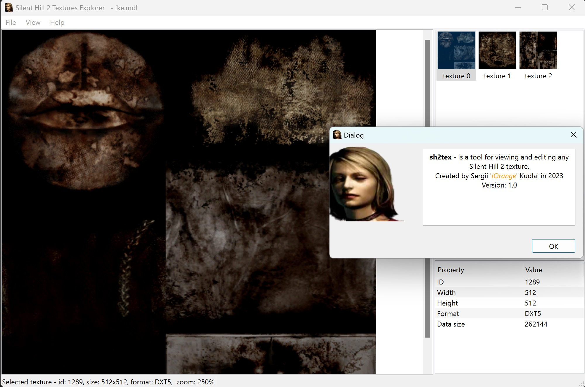
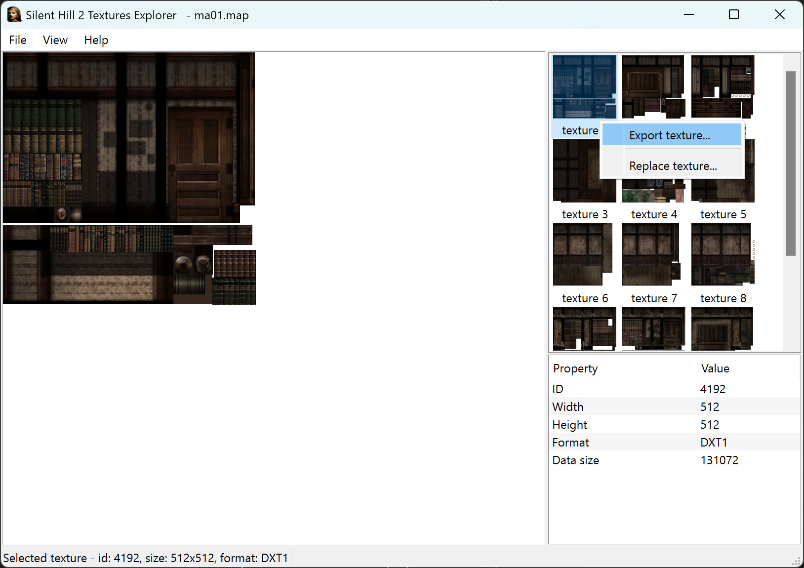
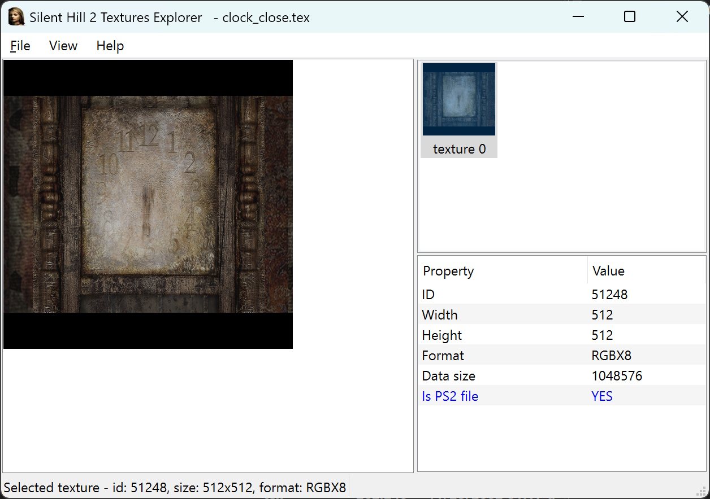

# sh2tex
Silent Hill 2 Textures Explorer - is the tool that was born from my reverse-engineering of Silent Hill 2 resource formats.
I became very handy to not only as a playground for me to make sure I can read any texture format of the game, but also proved useful for modding and preservation.

It can load these types of resources:

- *.tex and *.tbn2 - standalone textures files (tbn2 can contain more than 1 texture)
- *.mdl - models from the game, usually contain more than 1 texture
- *.map - levels from the game, usually contain more than 1 texture

You can view, extract and replace any of the texture inside any of the aforementioned files.

**sh2tex** supports drag & drop, as well as opening supported formats from the command line (so you can associate it with those files).

Use `Ctrl` + `+`/`-` combination to zoom in and out the selected image.

Have fun!

Additional thanks to [@Polymega](https://github.com/Polymega) for testing and providing valuable feedback!

